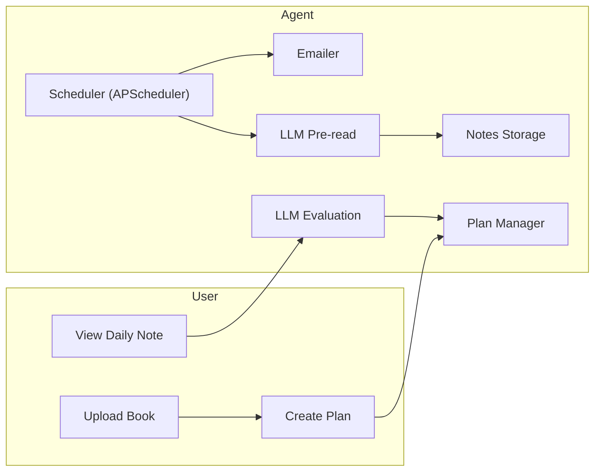

# 📚 AI Reading Assistant

An autonomous AI agent that helps you form a daily reading habit by generating reading plans, extracting key questions and summaries from books, and evaluating your reflections — all fully automated with no manual intervention required.

---

## What It Does

**AI Reading Assistant** helps users stay consistent with their reading goals through automation and AI guidance.

It supports:

- Uploading PDF books with automatic cover and metadata generation
- Creating structured reading plans distributed over a desired number of days
- Sending morning and evening email reminders (autonomously scheduled)
- Using LLM to extract summaries and reflection questions from daily reading
- Evaluating user's written answers and recommending whether to advance
- Tracking daily progress and updating plans intelligently

> This agent is fully autonomous — it schedules itself, performs daily tasks, and adapts without human intervention.

---

## Live Demo

[demo_video.mp4 - Google Drive](https://drive.google.com/file/d/1N1Q_dT-fG5Be3ZM4QAyRwKlFT8gI0H3L/view?usp=sharing)

---

## Tech Stack

| Layer       | Tools                                                          |
| ----------- | -------------------------------------------------------------- |
| Frontend    | [Streamlit](https://streamlit.io)                              |
| Scheduler   | [APScheduler](https://apscheduler.readthedocs.io)              |
| Email       | [Yagmail](https://github.com/kootenpv/yagmail)                 |
| PDF Parsing | [PyMuPDF](https://github.com/pymupdf/PyMuPDF)                  |
| LLM API     | [OpenRouter](https://openrouter.ai) using `GLM-4.5-Air (free)` |
| Environment | Python 3.9+                                                    |

---

## System Overview



---

## Installation & Setup

1. **Clone the repo**

```bash
git clone https://github.com/Tereams/ai-reading-assistant.git
cd ai-reading-assistant
```

2. **Install dependencies**

```bash
pip install -r requirements.txt
```

3. **Create `.env` file**

```env
SENDER_EMAIL=your_gmail@gmail.com
APP_PASSWORD=your_gmail_app_password
API_KEY=your_openrouter_api_key
```

4. **Run the Streamlit frontend**

```bash
streamlit run Home.py
```

5. **Run the scheduler in parallel**

```bash
python scheduler.py
```

---

## Project Structure

```
├── Home.py                 # Main Streamlit homepage
├── scheduler.py            # Daily task runner (morning/evening)
├── pages/
│   ├── 1_User_Settings.py      # User email & reminder settings
│   ├── 2_Upload_Book.py        # Upload PDF & extract metadata
│   ├── 3_Create_Plan.py        # Create reading plan
│   ├── 4_Switch_Plan.py        # Switch current reading plan
│   ├── 5_View_Daily_Notes.py   # Fill answers & evaluate
├── core/
│   ├── emailer.py          # Send emails
│   ├── llm_preread.py      # Extract questions & summary using LLM
│   ├── llm_feedback.py     # Evaluate answers using LLM
│   ├── pdf_parser.py       # Extract cover & TOC from PDF
│   └── planer.py           # Reading plan assignment & advancement
├── resource/
│   ├── book_dir/           # Uploaded PDFs
│   ├── covers/             # Auto-generated cover images
│   ├── metadata/           # Book metadata + reading plans
│   ├── notes.json          # Daily reading records
│   └── user.json           # User preferences
├── requirements.txt
├── .env.sample
└── README.md
```

---

## Key Features

- Fully autonomous loop (Trigger → LLM → Evaluate → Advance)
- Modular & extensible code
- Prompt-engineered LLM interaction (GLM-4.5-Air, free model)
- Clear, structured daily feedback for continuous learning
- Runs for 24+ hours without manual intervention

---

## Acknowledgments

This project was developed as part of the **AI Agent Internship Take-Home Assignment**.
Big thanks to the reviewers — I hope this system reflects both my technical depth and product thinking.
